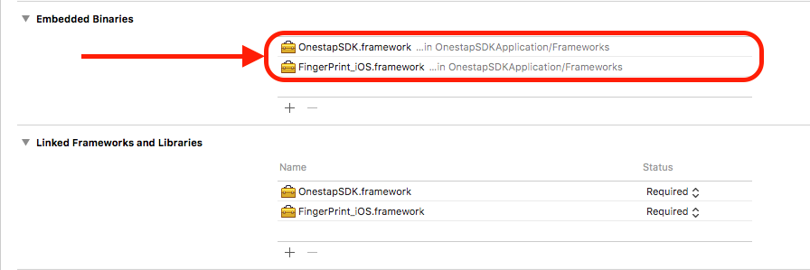
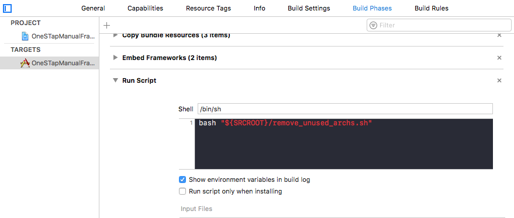
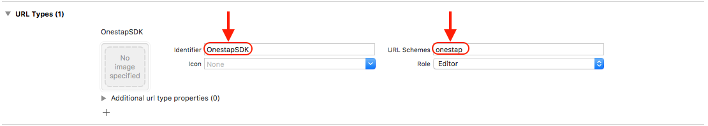
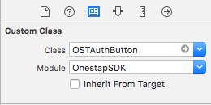
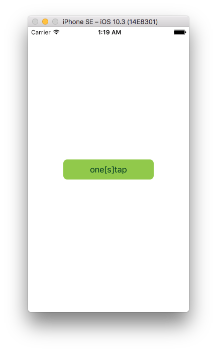
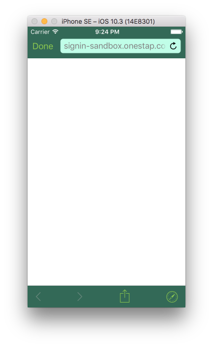
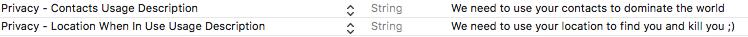

# one[s]tap SDK

[](https://www.bitrise.io/app/1eb8d7f99a95838c) [](https://codebeat.co/projects/github-com-stone-payments-onestap-sdk-ios-master) [](https://raw.githubusercontent.com/stone-payments/onestap-sdk-ios/master/LICENSE) [](https://github.com/stone-payments/onestap-sdk-ios/releases) [](https://github.com/Carthage/Carthage) [](http://cocoadocs.org/docsets/OnestapSDK/) 

Veja mais aqui: [OnestapSDK Reference](http://cocoadocs.org/docsets/OnestapSDK/)

## Como funciona

A OnestapSDK funciona recebendo `clientId` e `clientSecret` para abrir uma página web para logar exatamente como na autenticação do Facebook e do Google. O usuário irá logar no nosso ambiente e, caso seja bem sucedido, o usuário será redirecionado para a aplicação usando a previamente configurada `redirectUri`.

Quando a aplicação abre, a SDK irá procurar por parâmetros válidos na URI, para que então possa fazer requisições para recuperar o `accesToken`, o `refreshToken` e a `userKey`.

Com essas informações você será capaz de acessar as informações do usuário!

## Instalação

### Carthage

Coloque isto no seu Cartfile:

```yaml
github "stone-payments/onestap-sdk-ios" ~> 0.8
```

e então rode o seguinte comando:

```sh
carthage update
```
**OBS:** O Carthage irá baixar dois frameworks o `OnestapSDK.framework` e `FingerPrint_iOS.framework`, ambos devem ser colocados no seu app para que funcione corretamente.

### Cocoapods

Acrescente ao seu  `Podfile`

```ruby
target 'MyApplication' do
  use_frameworks!
  pod 'OnestapSDK', '~> 0.8'
end
```

### Instalação manual

Para instalar manualmente a SDK é necessário baixar o arquivo [OnestapSDK_Manual.framework.zip](https://github.com/stone-payments/onestap-sdk-ios/releases) e colocar em **Embedded Binaries** como na imagem abaixo:



Depois é necessário baixar o _script_ [remove_unused_archs.sh](https://raw.githubusercontent.com/stone-payments/onestap-sdk-ios/master/scripts/remove_unused_archs.sh) e adicionar em `Build Phases > Run Script` o seguinte comando: `bash "${SRCROOT}/remove_unused_archs.sh"` (lembrando que neste caso o script está no root do projeto, se o seu _script_ estiver em outra pasta é necessário informar o caminho desta pasta) como na imagem abaixo:



Ou se preferir, basta copiar o conteúdo do _script_ e colar dentro da "caixa" de _script_.


⚠️ Estes passos são necessários para rodar o _script_ manual porque ambos os frameworks contém todos as arquiteturas dentro dele, mas a loja da Apple não permite publicar o app com as arquiteturas de simulador, por isso este post _script_ garante a remoção destas arquiteturas para que a publicação ocorra sem problemas. ⚠️

## Usabilidade

### Configuração

No seu projeto, clique na aba "_Info_" e selecione _Url Types_. No campo `identifier`, é obrigatório que o nome seja **OnestapSDK**, e na _URL Schemes_ você deve colocar o esquema que foi configurado para seu Merchant URI, por exemplo:

Se a Merchant URI registrada é `onestap://application` sua Url Schemes deve ser **onestap**; em outras palavras, tudo **antes de** `://` é sua _Url Scheme_.



### Inicialização

É necessário inicializar a classe de login na abertura do app no `AppDelegate.swift`, e colar o código abaixo. O parâmetro fingerPrintID é opcional, deve ser passado apenas se quiser utilizar o anti-fraude.

```swift
func application(_ application: UIApplication, didFinishLaunchingWithOptions launchOptions: [UIApplicationLaunchOptionsKey: Any]?) -> Bool {
    let configuration: OSTConfiguration = OSTConfiguration(environment: .sandbox,
                                                           clientId: "{SEU_CLIENT_ID}",
                                                           clientSecret: "{SEU_CLIENT_SECRET}",
                                                           scheme: "{SEU_SCHEME}", // ex: onestap
                                                           host: "{SEU_HOST}", // ex: ios -- a url final ficaria onestap://ios
                                                           fingerPrintId: "{SEU_FINGERPRINT_ID}") // opcional
                                                           primaryColor: UIColor(), // OPCIONAL cor primária para abrir no SafariViewController
                                                           secondaryColor: UIColor()) // // OPCIONAL cor sencundária para abrir no SafariViewController
    _ = OST(configuration: configuration)
    return true
}
```

Para usar os métodos da SDK basta chamar ela desta forma pois contém a instância iniciada no `AppDelegate`:

```swift
OST.shared
```

Após esta inicialização, se for passado o `fingerPrintId`, o `fingerPrintSessionId` será criado e você poderá acessá-lo chamando o `UserDefaults` como no exemplo abaixo:

```swift
if let fingerPrintSessionId = UserDefaults.standard.fingerPrintSessionId {
    print(fingerPrintSessionId)
}
```

### ViewController

O login terá início aqui. Alguma ação irá ativar a página de login; se tudo funcionar corretamente, a página web irá redirecionar de volta para a aplicação.

### Login com botão

Você pode carregar o botão e customizá-lo de duas formas, uma pelo storyboard e outra no código.

#### Por código

No seu ViewController importe a SDK:

```swift
import OnestapSDK
```

```swift
class LoginViewController: UIViewController {
    var ostAuthButton: OSTAuthButton!
    override func viewDidLoad() {
        super.viewDidLoad()

        ostAuthButton = OSTAuthButton(frame: CGRect(x: 0, y: 0, width: 180, height: 40))
        ostAuthButton.center = view.center
        ostAuthButton.setTitle("Login!", for: .normal)
        view.addSubview(ostAuthButton)
    }
}
```

#### Pelo Storyboard

Basta arrastar um botão comum para o seu _Storyboard_ e clicar no _Identity inspector_ dizendo que o botão é de uma _custom class_ `OSTAuthButton` com o módulo `OnestapSDK` como na imagem abaixo:



O botão se parecerá com este:



### Login por método

#### Abrindo o browser do celular

Basta chamar o método `loadAuthPage` que ele irá abrir a página web para o login do usuário:

```swift
let ostAuth = OSTAuth()
ostAuth.auth.loadAuthPage()
```

#### Usando o SFSafariViewController

Basta chamar o método `loadAuthPage` passando como argumento a sua `UIViewCotroller` atual que ele irá abrir a página web no `SafariViewController` com as cores passadas no `OSTConfiguration`:

```swift
let ostAuth = OSTAuth()
ostAuth.loadAuthPage(viewController: self)
```

A página ficará desta maneira:



### Enviando dados de FingerPrint para o anti-fraude (opcional)

Com o FingerPrintID sendo enviado na inicialização da classe `OST`, enviar dados para o anti-fraude é muito simples, basta colocar permissões no seu app para o usuário liberar acesso aos contatos e o mesmo para localização.

**OBS:** Lembre-se que a Apple pode encrencar com a publicação do seu app se ele pedir permissão ao usuário de dados que são desnecessários para o app, não vale pedir acesso aos contatos do seu usuário se o seu app não faz nada com os contatos dele, não é mesmo?

Para pedir as permissões de acesso para o usuário basta acrescentar estas linhas no `Info.plist`:



### Transferência de Dados para Perfil temporário

Se desejar transferir os dados de cadastro que já tem em sua base para facilitar o cadastro e a transição do usuário para o nosso sistema, você pode usar a variável `temporaryProfile` para preencher os dados cadastrais do usuário.

Para utilizar basta atribuir um valor do tipo `TemporaryProfile` a variável `temporaryProfile` da classe `OSTConfiguration` antes de inicializar a SDK:

```swift
let tempProfile = TemporaryProfile()
var address = Address(street: "R. Dr. Satamini", number: "128", city: "Rio de Janeiro", state: "RJ")
address.country = "BR"
address.district = "Tijuca"
address.zipCode = "20270230"
tempProfile.addresses = []
tempProfile.addresses?.append(address)

let document = Document(documentType: .cpf, documentNumber: "57748217220")
tempProfile.documents = []
tempProfile.documents?.append(document)

var personalData = PersonalData()
personalData.country = "BR"
personalData.genderType = .masculine
tempProfile.personalData = personalData

let phone = Phone(phoneType: .mobile, fullNumber: "21986223524")
tempProfile.phones = []
tempProfile.phones?.append(phone)

var vehicle = Vehicle(licensePlate: "LNY-4266")
vehicle.licensePlateCity = "Rio de Janeiro"
vehicle.licensePlateCountry = "BR"
vehicle.licensePlateState = "RJ"
tempProfile.vehicles = []
tempProfile.vehicles?.append(vehicle)

let configuration: OSTConfiguration = OSTConfiguration(environment: .sandbox,
                                                        clientId: "{SEU_CLIENT_ID}",
                                                        clientSecret: "{SEU_CLIENT_SECRET}",
                                                        scheme: "{SEU_SCHEME}",
                                                        host: "{SEU_HOST}",
                                                        fingerPrintId: "{SEU_FINGERPRINT}",
                                                        temporaryProfile: tempProfile)
_ = OST(configuration: configuration)
```

Com isso a tela de cadastro irá se abrir com os dados já preenchidos no ato do cadastro do usuário.

### AppDelegate

Após um login bem sucedido, o redirecionamento passará por aqui com alguma informação de login, porém apenas depois do método `handleRedirect(fromUrl: URL)` funcionar sem problemas é que nós seremos capazes de recuperar o **Token Data**.

```swift
func application(_ app: UIApplication, open url: URL, options: [UIApplicationOpenURLOptionsKey : Any] = [:]) -> Bool {
    let ostAuth = OSTAuth()
    ostAuth.handleRedirect(fromUrl: url) { result in
        switch result {
        case .success(let tokens):
            print("Access Token: \(tokens.accessToken!)")
            print("Refresh Token: \(tokens.refreshToken!)")
            print("User Key: \(tokens.userKey!)")
            // DO SOMETHING
        case .failure(let error):
            print(error)
            // HANDLE ERRORS
        }
    }
 
    return true
}
```

O método retornará, caso sucesso, um objeto de tokens e gravará os tokens no `UserDefaults`.
Você deverá ser capaz de usar o `accessToken`, `refreshToken` e a `userKey` se digitar o seguinte:

```swift
let accessToken: String? = UserDefaults.standard.accessToken
let userKey: String? = UserDefaults.standard.userKey
let refreshToken: String? = UserDefaults.standard.refreshToken
```

### Refresh Token

Se o token expirar, basta fazer a implementação que segue:

```swift
let ostAuth = OSTAuth()
ostAuth.revokeToken { result in
    switch result {
    case .success(let tokens):
        // DO SOMETHING
    case .failure(let error):
        print(error)
        // HANDLE ERROR
    }
}
```

### Verificar o Token

Verifica se o token ainda é válido:

```swift
let ostAuth = OSTAuth()
ostAuth.verifyToken { result in
    switch result {
    case .success(let tokens):
        // DO SOMETHING
    case .failure(let error):
        print(error)
        // HANDLE ERROR
    }
}
```

### Revogar Token

Para revogar o Token do usuário, basta chamar o método `revokeToken` como no exemplo abaixo:

```swift
let ostAuth = OSTAuth()
ostAuth.revokeToken { result in
    switch result {
    case .success(let genericResponse):
        print(genericResponse.operationReport)
        // DO SOMETHING
    case .failure(let error):
        print(error)
        // DO SOMETHING
    }
}
```

### Buscar dados de usuário

Para buscar os dados do usuário basta seguir com a seguinte implementação:

```swift
let ostUser = OSTUser()
let toInclude: [OSTCategoriesEnum] = [.personalData, .emails, .phones, .documents, .addresses, .vehicles]
ostUser.getUser(categories: toInclude) { (result: Result<Account>) in    
    switch result {
    case .success(let account):
        // DO SOMETHING
    case .failure(let error):
        // HANDLE ERROR
    }
}
```

**OBS:** O parâmetro `including` é opcional. Se não for enviado nada o método retornará apenas o `publicProfile`.

## Contribuições

Pull Requests serão muito bem-vindos! Leia o nosso [Contributing](./CONTRIBUTING.md)

## Problemas

Algum problema, dúvida ou sugestão? [Abra uma issue!](https://github.com/stone-payments/onestap-sdk-ios/issues/new)
